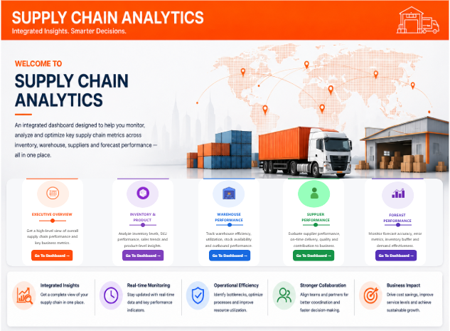
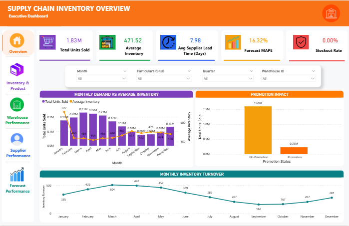
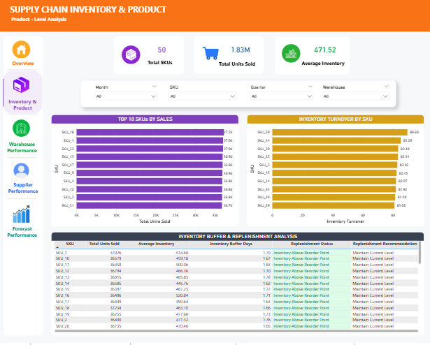
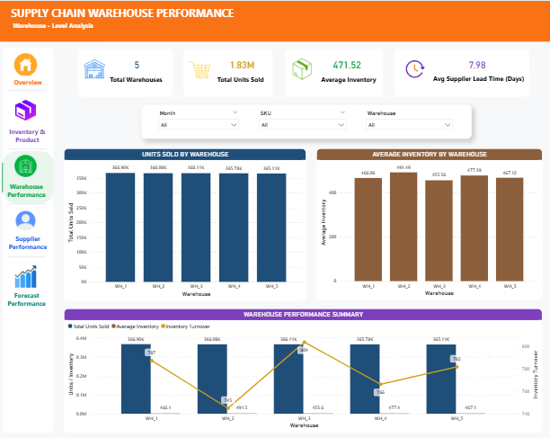
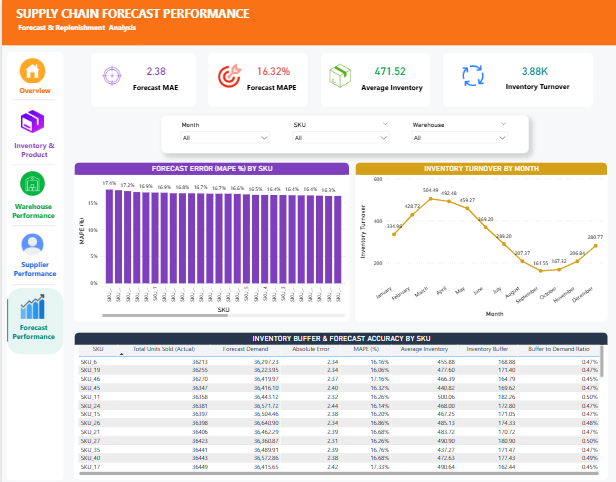

# 📦 Supply Chain Analytics

An end-to-end supply chain analytics project focused on analyzing inventory, product performance, warehouse operations, supplier performance, and forecast accuracy using SQL, Python, Jupyter Notebook, and Power BI.

The project transforms raw supply chain data into actionable business insights through SQL analysis, exploratory data analysis, data visualization, and an interactive Power BI dashboard.

---

## 📌 Project Overview

Effective supply chain management requires organizations to continuously monitor inventory levels, product demand, warehouse operations, supplier performance, and forecast accuracy.

This project analyzes supply chain data to identify:

- Inventory and product-level performance
- Warehouse operational performance
- Supplier performance and lead times
- Demand and inventory trends
- Forecast accuracy and demand deviations
- Inventory turnover
- Inventory buffer requirements
- Potential replenishment requirements
- Opportunities for supply chain optimization

The project follows an end-to-end analytics workflow:

**Kaggle Dataset → SQL Database → SQL Analysis → Python EDA → Power BI Dashboard → Business Insights**

---

## 🎯 Business Objectives

The main objectives of this project are to:

- Analyze overall supply chain performance
- Identify high- and low-performing products
- Evaluate inventory levels and inventory turnover
- Monitor warehouse performance
- Assess supplier lead times and supplier performance
- Analyze demand and forecast accuracy
- Measure forecast error using MAE and MAPE
- Analyze inventory buffer requirements
- Identify potential replenishment requirements
- Support data-driven supply chain decision-making

---

## 🛠️ Tools & Technologies

| Tool | Purpose |
|---|---|
| **SQL Server** | Database creation, table creation, data loading, and analysis |
| **SQL** | Analytical queries, business calculations, and views |
| **Python** | Exploratory data analysis |
| **Pandas** | Data manipulation and analysis |
| **Jupyter Notebook** | EDA and data exploration |
| **Power BI** | Interactive dashboard and visualization |
| **DAX** | Measures and calculated metrics |
| **Power Query** | Data preparation and transformation |
| **GitHub** | Project documentation and version control |

---

## 📊 Power BI Dashboard

The Power BI dashboard provides an interactive view of supply chain performance across multiple analytical areas.

### 🏠 1. Home

The Home page acts as the main navigation page of the dashboard.

It provides access to:

- Executive Overview
- Inventory & Product
- Warehouse Performance
- Supplier Performance
- Forecast Performance

Each section can be accessed through the corresponding navigation button.

### 📈 2. Executive Overview

Provides a high-level overview of overall supply chain performance.

Key KPIs and analyses include:

- Total Units Sold
- Average Inventory
- Average Supplier Lead Time
- Forecast MAPE
- Stockout Rate
- Monthly Demand
- Inventory Turnover
- Promotion Impact

### 📦 3. Inventory & Product

Focuses on product-level performance and inventory management.

The analysis includes:

- Units Sold by SKU
- Inventory Performance
- Inventory Turnover
- Average Inventory
- Inventory Buffer
- Buffer-to-Demand Ratio
- Reorder Status
- Replenishment Analysis
- Product-level demand patterns

### 🏭 4. Warehouse Performance

Analyzes warehouse-level operational performance.

The page provides insights into:

- Warehouse performance
- Warehouse utilization
- Inventory availability
- Operational efficiency
- Warehouse-level comparisons

### 🤝 5. Supplier Performance

Evaluates supplier performance and delivery-related metrics.

The analysis focuses on:

- Supplier lead time
- Supplier performance
- Delivery-related performance
- Supplier comparisons
- Operational reliability

### 🔮 6. Forecast Performance

Analyzes demand forecasting performance and forecast deviations.

Key areas include:

- Actual Demand
- Forecasted Demand
- Forecast MAE
- Forecast MAPE
- Forecast deviations
- Inventory Buffer
- Buffer-to-Demand Ratio

---

## 📐 Key Metrics

### MAE — Mean Absolute Error

MAE measures the average absolute difference between actual demand and forecasted demand.

A lower MAE generally indicates that forecasted demand is closer to actual demand.

### MAPE — Mean Absolute Percentage Error

MAPE measures forecast error as a percentage of actual demand.

A lower MAPE generally indicates better forecast accuracy.

### Inventory Turnover

Inventory turnover indicates how efficiently inventory is being utilized relative to demand or sales.

### Inventory Buffer

Inventory buffer represents additional inventory maintained to help manage demand and supply variability.

### Buffer-to-Demand Ratio

The buffer-to-demand ratio compares inventory buffer against demand and provides additional context for inventory planning.

### Stockout Rate

Stockout rate indicates the proportion of demand or inventory situations where required stock was unavailable.

---

## 📸 Dashboard Screenshots

### 🏠 Home

### 📈 Executive Overview

### 📦 Inventory & Product

### 🏭 Warehouse Performance

### 🤝 Supplier Performance

### 🔮 Forecast Performance

---

## 🗄️ SQL Analysis

The SQL component contains the complete database setup, data loading, analysis queries, and reusable views.

The SQL workflow consists of:

1. Creating the SQL Server database
2. Creating the required database tables
3. Loading the supply chain dataset
4. Performing analytical SQL queries
5. Creating reusable SQL views for analysis and reporting

The SQL layer provides the structured data foundation for the Python analysis and Power BI reporting workflow.

The SQL folder contains:

- 01_CreateDatabase.sql
- 02_CreateTables.sql
- 03_LoadData.sql
- 04_AnalysisQueries.sql
- 05_Views.sql

---

## 🐍 Python & Exploratory Data Analysis

The project includes a Jupyter Notebook containing exploratory data analysis.

The EDA covers:

- Dataset exploration
- Data structure and data types
- Missing-value analysis
- Descriptive statistics
- Distribution analysis
- Product analysis
- Inventory analysis
- Supplier analysis
- Warehouse analysis
- Demand and sales analysis
- Forecast-related analysis
- Data visualization
- Identification of important patterns and relationships

The notebook included in the repository is:

**01_EDA.ipynb**

---

## 📁 Dataset

The dataset used in this project was obtained from Kaggle.

**Dataset:** High-Dimensional Supply Chain Inventory Dataset

**Dataset Author:** ziya07

**Source:** Kaggle

The original dataset can be accessed here:

https://www.kaggle.com/datasets/ziya07/high-dimensional-supply-chain-inventory-dataset

The dataset is used for analytical and educational purposes.

---

## 📂 Project Structure

The repository is organized into the following components:

- **Data/** — Source supply chain dataset
- **SQL/** — Database creation, loading, analytical queries, and views
- **screenshots/** — Power BI dashboard screenshots
- **01_EDA.ipynb** — Python exploratory data analysis
- **Supply Chain Dashboard.pbix** — Power BI dashboard
- **README.md** — Project documentation

---

## 🔄 Project Workflow

The overall project workflow is:

**Kaggle Dataset**

↓

**Data Preparation**

↓

**SQL Database**

↓

**SQL Analysis & Views**

↓

**Python Exploratory Data Analysis**

↓

**Power BI Data Model**

↓

**Interactive Power BI Dashboard**

↓

**Business Insights**

---

## 🔍 Key Business Insights

The project enables analysis of:

- Products with different demand and inventory patterns
- High- and low-inventory-turnover products
- Products requiring closer inventory monitoring
- Warehouse-level performance differences
- Supplier lead-time variations
- Forecast deviations
- Inventory buffer levels relative to demand
- Potential replenishment requirements
- Opportunities for inventory optimization

These insights can support better inventory planning, procurement decisions, supplier management, warehouse operations, and demand planning.

---

## 🚀 How to Use

### SQL Analysis

Open the SQL scripts in SQL Server Management Studio and execute them in the following sequence:

**01_CreateDatabase.sql**

**02_CreateTables.sql**

**03_LoadData.sql**

**04_AnalysisQueries.sql**

**05_Views.sql**

### Python EDA

Open **01_EDA.ipynb** using Jupyter Notebook or JupyterLab.

### Power BI Dashboard

Open **Supply Chain Dashboard.pbix** using Power BI Desktop to explore the interactive dashboard.

---

## 📦 Project Deliverables

This repository contains:

- 📊 Interactive Power BI dashboard
- 🐍 Python exploratory data analysis
- 🗄️ SQL database scripts
- 🔎 SQL analytical queries
- 👁️ SQL views
- 📁 Source dataset
- 📸 Power BI dashboard screenshots
- 📄 Project documentation

---

## 👤 Author

### Prakhar Varshney

**Data Analyst | SQL | Python | Power BI**

---

⭐ If you found this project useful, feel free to explore the repository and dashboard.
